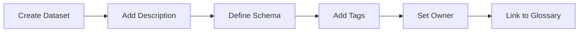
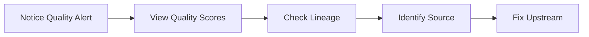
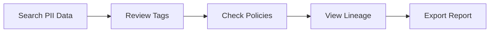

# MetaHub — Complete Product & Integration Guide

<p align="center">
  
</p>

---

## 📑 Table of Contents

1. [Executive Summary](#executive-summary)
2. [The Problem We Solve](#the-problem-we-solve)
3. [Why MetaHub Exists](#why-metahub-exists)
4. [How MetaHub Solves These Problems](#how-metahub-solves-these-problems)
5. [Who Can Use MetaHub](#who-can-use-metahub)
6. [How to Use MetaHub](#how-to-use-metahub)
7. [Integration with MDM Platforms](#integration-with-mdm-platforms)
8. [Integration Guide](#integration-guide)
9. [Architecture & Technical Details](#architecture--technical-details)
10. [Deployment Options](#deployment-options)
11. [Best Practices](#best-practices)
12. [Roadmap & Future Enhancements](#roadmap--future-enhancements)

---

## Executive Summary

**MetaHub** is an enterprise-grade, AI-powered unified metadata management platform that helps organizations discover, understand, govern, and trust their data assets. Built with modern technologies (Spring Boot 3.2 + React 18), MetaHub provides a centralized repository for all metadata across your data ecosystem, enabling data teams to:

- **Discover** data assets through AI-powered natural language search
- **Understand** data through lineage visualization and business glossaries
- **Govern** data through policy management and compliance tracking
- **Trust** data through quality scoring and audit trails

---

## The Problem We Solve

### 🔴 The Modern Data Challenge

Organizations today face a **metadata chaos crisis**:

```
┌────────────────────────────────────────────────────────────────────────┐
│                     THE METADATA CHAOS                                 │
├────────────────────────────────────────────────────────────────────────┤
│                                                                        │
│   ┌──────────┐    ┌──────────┐    ┌──────────┐    ┌──────────┐         │
│   │ Data     │    │  Data    │    │  BI      │    │  ML      │         │
│   │ Warehouse│    │  Lake    │    │ Platform │    │ Platform │         │
│   └────┬─────┘    └────┬─────┘    └────┬─────┘    └────┬─────┘         │
│        │               │               │               │               │
│        ▼               ▼               ▼               ▼               │
│   ┌──────────────────────────────────────────────────────────┐         │
│   │                    ❓ WHERE IS MY DATA?                   │         │
│   │                    ❓ WHAT DOES IT MEAN?                  │         │
│   │                    ❓ CAN I TRUST IT?                     │         │
│   │                    ❓ WHO OWNS IT?                        │         │
│   │                    ❓ WHERE DID IT COME FROM?             │         │
│   │                    ❓ IS IT COMPLIANT?                    │         │
│   └──────────────────────────────────────────────────────────┘         │
│                                                                        │
└────────────────────────────────────────────────────────────────────────┘
```

### Specific Problems Organizations Face

| Problem | Impact | Cost |
|---------|--------|------|
| **Data Silos** | Data scientists spend 80% of time finding and preparing data | $100K+ per data scientist annually in lost productivity |
| **No Data Lineage** | Cannot trace data origin or transformations | Compliance failures, audit issues, trust erosion |
| **Missing Documentation** | New team members take months to understand data | Increased onboarding time, knowledge loss when employees leave |
| **Governance Gaps** | PII data exposed, no access controls documented | GDPR/CCPA fines up to 4% of annual revenue |
| **Quality Issues** | Bad data leads to bad decisions | Average cost of poor data quality: $12.9M annually (Gartner) |
| **MDM Disconnection** | Master data exists but isn't documented or searchable | Duplicate efforts, inconsistent data definitions |

### Real-World Scenarios

**Scenario 1: The Lost Dataset**
> A data analyst needs customer purchase history. They spend 3 days emailing colleagues, searching SharePoint, and querying random tables before finding the right dataset in an undocumented schema.

**Scenario 2: The Compliance Nightmare**
> An auditor asks: "Show me all datasets containing PII." The data team scrambles for 2 weeks to manually inventory 500+ tables across 12 systems.

**Scenario 3: The Broken Pipeline**
> A Spark job fails. The team has no idea which downstream reports are affected because there's no lineage documentation. They spend 4 hours in "war room" mode.

**Scenario 4: The MDM Disconnect**
> The company invested millions in Riversand MDM for product data, but data teams don't know which MDM entities feed which analytics tables. There's no bridge between operational and analytical metadata.

---

## Why MetaHub Exists

### Our Mission

> **To democratize data understanding by making metadata accessible, intelligent, and actionable for everyone in the organization.**

### Core Beliefs

1. **Metadata is a product** — It should be curated, versioned, and treated as a first-class citizen
2. **AI should augment humans** — Not replace them, but make them 10x more productive
3. **Integration over isolation** — A metadata platform must connect to everything
4. **Self-service empowerment** — Business users should find answers without IT tickets

### Why Another Metadata Tool?

| Existing Solutions | MetaHub Advantage |
|-------------------|-------------------|
| **Expensive commercial tools** (Collibra, Alation) — $500K+ annual license | Open-source core, enterprise features at 1/10th the cost |
| **Complex to deploy** — months of professional services | Single `docker-compose up` deployment |
| **No AI capabilities** or basic keyword search | AI-powered natural language search, smart suggestions |
| **Poor MDM integration** — metadata silos continue | First-class MDM integration patterns (Riversand, Informatica, Reltio) |
| **Developer-hostile** — require specialized skills | Modern REST API, React UI, extensible architecture |

---

## How MetaHub Solves These Problems

### Solution Architecture

```
┌─────────────────────────────────────────────────────────────────────────┐
│                         MetaHub Platform                                │
├─────────────────────────────────────────────────────────────────────────┤
│                                                                         │
│   ┌───────────────────────────────────────────────────────────────┐     │
│   │                    🤖 AI Layer                                │     │
│   │  • Natural Language Search    • Smart Tag Suggestions         │     │
│   │  • Sensitivity Detection      • Auto Description Generation   │     │
│   │  • Governance Insights        • Quality Recommendations       │     │
│   └───────────────────────────────────────────────────────────────┘     │
│                                                                         │
│   ┌─────────────┐ ┌─────────────┐ ┌─────────────┐ ┌─────────────┐       │
│   │  📊 Dataset │ │  🔗 Data    │ │  🛡 Data     │ │  📈 Data    │       │
│   │   Catalog   │ │   Lineage   │ │  Governance │ │   Quality   │       │
│   └─────────────┘ └─────────────┘ └─────────────┘ └─────────────┘       │
│                                                                         │
│   ┌─────────────┐ ┌─────────────┐ ┌─────────────┐ ┌─────────────┐       │
│   │  📖 Business│ │  📝 Audit   │ │  💬 Collab- │ │  📥 Metadata│       │
│   │   Glossary  │ │    Logs     │ │   oration   │ │   Ingestion │       │
│   └─────────────┘ └─────────────┘ └─────────────┘ └─────────────┘       │
│                                                                         │
│   ┌───────────────────────────────────────────────────────────────┐     │
│   │              🔌 Integration Layer                             │     │
│   │  • JDBC Connectors     • REST API Connectors                  │     │
│   │  • MDM Adapters        • Cloud Storage Connectors             │     │
│   │  • Event Streams       • Webhook Notifications                │     │
│   └───────────────────────────────────────────────────────────────┘     │
│                                                                         │
└─────────────────────────────────────────────────────────────────────────┘
```

### Feature-to-Problem Mapping

| Problem | MetaHub Solution | Feature |
|---------|------------------|---------|
| **"Where is my data?"** | AI-powered natural language search | Search: "find customer data with email" |
| **"What does it mean?"** | Business glossary with term definitions | Glossary linked to datasets |
| **"Where did it come from?"** | Visual lineage graphs | Upstream/downstream DAG visualization |
| **"Can I trust it?"** | Automated quality scoring | Completeness, freshness, schema scores |
| **"Is it compliant?"** | PII detection + governance policies | Auto-tag PII, attach policies |
| **"Who owns it?"** | Dataset ownership + comments | Owner assignment, team collaboration |
| **"How do I connect MDM?"** | Integration adapters | REST/event-based MDM sync |

### Example: Finding PII Data in Seconds

**Before MetaHub:**
```
Day 1: Email data stewards asking for PII inventory
Day 2: Wait for responses, schedule meetings  
Day 3: Manually inspect database schemas
Day 4: Create spreadsheet, share with compliance
Day 5: Realize you missed 3 systems, start over
```

**With MetaHub:**
```
User: "Show me all datasets containing PII"

AI: Found 4 datasets with PII data:
  ✓ customers (email, phone, address) — PII, GDPR tagged
  ✓ employees (SSN, salary) — Restricted, HIPAA
  ✓ leads (email, name) — PII, Marketing
  ✓ contacts (phone, address) — PII, CRM

Time: 2 seconds
```

---

## Who Can Use MetaHub

### Target Users & Use Cases

| Persona | Role | Primary Use Cases |
|---------|------|-------------------|
| **Data Engineers** | Build and maintain data pipelines | • Find source datasets<br>• Document transformations<br>• Track lineage<br>• Debug pipeline issues |
| **Data Analysts** | Create reports and dashboards | • Discover relevant datasets<br>• Understand column meanings<br>• Find trusted data sources<br>• Collaborate with data owners |
| **Data Scientists** | Build ML models | • Find training data<br>• Understand feature definitions<br>• Identify PII for anonymization<br>• Track model lineage |
| **Data Stewards** | Govern and curate data | • Define policies<br>• Tag sensitive data<br>• Manage glossary terms<br>• Monitor compliance |
| **Data Architects** | Design data platforms | • Document data models<br>• Visualize enterprise lineage<br>• Plan MDM integration<br>• Assess data quality |
| **Business Users** | Consume data for decisions | • Search for business metrics<br>• Understand data definitions<br>• Request data access<br>• View data lineage |
| **Compliance Officers** | Ensure regulatory compliance | • Audit PII exposure<br>• Track policy adherence<br>• Generate compliance reports<br>• Monitor data access |

### Industry Applications

| Industry | Key Use Cases |
|----------|---------------|
| **Financial Services** | Regulatory reporting lineage, PII compliance, risk data governance |
| **Healthcare** | HIPAA compliance, PHI tracking, clinical data cataloging |
| **Retail/CPG** | Product data management, customer 360 lineage, MDM integration |
| **Manufacturing** | Asset data governance, IoT metadata, supply chain lineage |
| **Technology** | ML feature stores, API documentation, microservice data contracts |

---

## How to Use MetaHub

### Quick Start Guide

#### Step 1: Access the Platform

```bash
# Start MetaHub (development mode)
cd metahub
mvn spring-boot:run -Dspring-boot.run.profiles=dev

# Start the frontend
cd frontend
npm run dev

# Open in browser
http://localhost:5173
```

#### Step 2: Explore the Dashboard

The dashboard provides an overview of your metadata:

```
┌─────────────────────────────────────────────────────────────────┐
│                     MetaHub Dashboard                           │
├─────────────────────────────────────────────────────────────────┤
│  ┌──────────┐  ┌──────────┐  ┌──────────┐  ┌──────────┐         │
│  │ 40       │  │ 85%      │  │ 5        │  │ Search → │         │
│  │ Datasets │  │ Quality  │  │ Bookmarks│  │          │         │
│  └──────────┘  └──────────┘  └──────────┘  └──────────┘         │
│                                                                 │
│  🤖 AI Assistant: Ask me anything about your data!              │
│                                                                 │
│  ⭐ My Bookmarks          📚 Quick Start                         │
│  • customers              • Browse the Catalog                  │
│  • orders                 • Search for datasets                 │
│  • dim_products           • View Lineage graphs                 │
│                                                                 │
└─────────────────────────────────────────────────────────────────┘
```

#### Step 3: Search for Data

Use natural language to find datasets:

| Query | What MetaHub Does |
|-------|-------------------|
| "customer data" | Searches names, descriptions, tags for "customer" |
| "PII datasets" | Finds datasets tagged with PII or containing PII columns |
| "revenue metrics" | Searches financial datasets with revenue-related columns |
| "who owns orders table" | Shows ownership information for orders dataset |

#### Step 4: Explore Lineage

1. Navigate to **Lineage** page
2. Select a dataset from the dropdown
3. View the interactive graph showing:
   - **Upstream** sources (where data comes from)
   - **Downstream** consumers (where data goes)
   - **Transformation jobs** on each edge

#### Step 5: Use the AI Assistant

Click the **🤖 bot icon** (bottom-right) to chat:

```
You: "Find datasets with customer email"

AI: Found 4 relevant datasets:
  • customers - Contains PII (email, phone, address)
  • leads - Sales leads with email
  • contacts - CRM contacts with email
  • dim_customers - Customer dimension table

[Click any result to view details]
```

#### Step 6: Manage Governance

1. Go to **Governance** page
2. Create policies (e.g., "GDPR Data Retention Policy")
3. Attach datasets to policies
4. Track policy compliance across your data estate

### Common Workflows

#### Workflow 1: Document a New Dataset



#### Workflow 2: Investigate Data Quality Issue



#### Workflow 3: Prepare for Audit



---

## Integration with MDM Platforms

### Why Integrate MetaHub with MDM?

Master Data Management (MDM) platforms like **Riversand**, **Informatica MDM**, **Reltio**, and **Stibo** manage the **golden records** of your business entities (products, customers, suppliers). However, MDM platforms focus on **operational master data** and often lack:

- **Analytical metadata context** — How does MDM data flow to data warehouses?
- **Data lineage visibility** — What transformations occur between MDM and analytics?
- **Cross-platform search** — How to find MDM entities alongside analytical tables?
- **Unified governance** — How to apply consistent policies across MDM and analytics?

```
┌─────────────────────────────────────────────────────────────────────────┐
│           The MDM-Analytics Metadata Gap                                │
├─────────────────────────────────────────────────────────────────────────┤
│                                                                         │
│   MDM Platform                           Data Platform                  │
│   ┌──────────────────┐                   ┌──────────────────┐           │
│   │ Product Master   │                   │ dim_products     │           │
│   │ Customer Master  │     ??? GAP ???   │ fact_sales       │           │
│   │ Vendor Master    │                   │ customer_360     │           │
│   └──────────────────┘                   └──────────────────┘           │
│                                                                         │
│   Questions that cannot be answered:                                    │
│   • Which MDM attributes feed which analytical columns?                 │
│   • When MDM product hierarchy changes, what reports break?             │
│   • Is the customer_id in analytics the same as MDM customer_id?        │
│   • What's the data quality difference between MDM and warehouse?       │
│                                                                         │
└─────────────────────────────────────────────────────────────────────────┘
```

### MetaHub Bridges the Gap

```
┌─────────────────────────────────────────────────────────────────────────┐
│               MetaHub: Unified Metadata Layer                           │
├─────────────────────────────────────────────────────────────────────────┤
│                                                                         │
│           ┌────────────────────────────────────────────┐                │
│           │              MetaHub Platform              │                │
│           │                                            │                │
│           │  • Unified search across MDM + Analytics   │                │
│           │  • End-to-end lineage visualization        │                │
│           │  • Consistent governance policies          │                │
│           │  • Cross-platform data quality tracking    │                │
│           │  • AI-powered entity matching suggestions  │                │
│           │                                            │                │
│           └──────────────────┬─────────────────────────┘                │
│                              │                                          │
│           ┌──────────────────┼──────────────────┐                       │
│           │                  │                  │                       │
│           ▼                  ▼                  ▼                       │
│   ┌──────────────┐   ┌──────────────┐   ┌──────────────┐                │
│   │  Riversand   │   │  Informatica │   │    Data      │                │
│   │     MDM      │   │     MDM      │   │  Warehouse   │                │
│   └──────────────┘   └──────────────┘   └──────────────┘                │
│                                                                         │
└─────────────────────────────────────────────────────────────────────────┘
```

### Supported MDM Platforms

| Platform | Integration Method | Features |
|----------|-------------------|----------|
| **Riversand MDM** | REST API + Webhooks | Entity sync, attribute mapping, lineage tracking |
| **Informatica MDM** | REST API + Events | Master data import, relationship mapping, quality sync |
| **Reltio** | REST API | Entity resolution metadata, match rules documentation |
| **Stibo STEP** | REST API | Product hierarchy sync, attribute definitions |
| **SAP MDG** | OData API | Material/vendor/customer master metadata |
| **Oracle MDM** | REST API | Customer hub, product hub metadata |

### Integration Benefits

| Benefit | Description |
|---------|-------------|
| **Unified Search** | Search "product" finds both MDM entities and warehouse tables |
| **Complete Lineage** | See data flow: MDM → ETL → Warehouse → Reports |
| **Governance Alignment** | Same policies apply to MDM and analytical data |
| **Quality Correlation** | Compare data quality scores across platforms |
| **Impact Analysis** | Know which analytics break when MDM changes |
| **Business Context** | MDM business definitions enrich technical metadata |

---

## Integration Guide

### Architecture Patterns

#### Pattern 1: Pull-Based Integration (Batch)

```
┌──────────────┐      ┌──────────────┐      ┌──────────────┐
│  MDM System  │      │   MetaHub    │      │   MetaHub    │
│              │─────▶│   Ingestion  │─────▶│   Database   │
│  REST API    │      │   Service    │      │              │
└──────────────┘      └──────────────┘      └──────────────┘

Schedule: Every 15 minutes / hourly / daily
```

**Best for:** Initial sync, full refresh, systems without webhooks

#### Pattern 2: Push-Based Integration (Real-Time)

```
┌──────────────┐      ┌──────────────┐      ┌──────────────┐
│  MDM System  │      │   MetaHub    │      │   MetaHub    │
│              │─────▶│   Webhook    │─────▶│   Database   │
│   Webhook    │      │   Receiver   │      │              │
└──────────────┘      └──────────────┘      └──────────────┘

Trigger: On entity create/update/delete
```

**Best for:** Real-time sync, event-driven architectures

#### Pattern 3: Event Stream Integration (Kafka)

```
┌──────────────┐      ┌──────────────┐      ┌──────────────┐
│  MDM System  │      │    Kafka     │      │   MetaHub    │
│              │─────▶│              │─────▶│   Consumer   │
│  Producer    │      │  Topic:mdm   │      │              │
└──────────────┘      └──────────────┘      └──────────────┘

Delivery: At-least-once, ordered by entity
```

**Best for:** High-volume, enterprise-scale deployments

---

### Riversand MDM Integration

#### Step 1: Configure Riversand Connection

```yaml
# application.yml
metahub:
  integrations:
    riversand:
      enabled: true
      base-url: https://your-tenant.riversand.com/api/v1
      api-key: ${RIVERSAND_API_KEY}
      tenant-id: your-tenant
      sync-interval: 15m
```

#### Step 2: Create Riversand Data Source

```bash
curl -X POST http://localhost:8080/api/v1/datasources \
  -H "Content-Type: application/json" \
  -d '{
    "name": "Riversand Product Hub",
    "type": "API",
    "connectionUrl": "https://your-tenant.riversand.com/api/v1",
    "description": "Riversand MDM - Product Domain",
    "credentials": "{\"apiKey\": \"your-api-key\", \"tenantId\": \"your-tenant\"}"
  }'
```

#### Step 3: Map Riversand Entities to MetaHub

```java
// RiversandIngestionStrategy.java (example implementation)
@Component
public class RiversandIngestionStrategy implements IngestionStrategy {

    @Override
    public boolean supports(DataSourceType type) {
        return type == DataSourceType.API && isRiversand(type);
    }

    @Override
    public List<Dataset> ingest(DataSource source) {
        // 1. Fetch entity types from Riversand
        List<EntityType> entityTypes = riversandClient.getEntityTypes();
        
        // 2. For each entity type, fetch attributes
        return entityTypes.stream()
            .map(this::mapToDataset)
            .collect(toList());
    }

    private Dataset mapToDataset(EntityType entityType) {
        Dataset dataset = new Dataset();
        dataset.setName(entityType.getName());
        dataset.setQualifiedName("riversand." + entityType.getDomain() + "." + entityType.getName());
        dataset.setDescription(entityType.getDescription());
        
        // Map attributes to columns
        SchemaDefinition schema = new SchemaDefinition();
        schema.setName("v1");
        schema.setColumns(entityType.getAttributes().stream()
            .map(this::mapToColumn)
            .collect(toList()));
        
        dataset.setSchemas(List.of(schema));
        return dataset;
    }
}
```

#### Step 4: Configure Webhook (Real-Time Sync)

```bash
# In Riversand Admin Console, configure webhook:
URL: https://your-metahub.com/api/v1/webhooks/riversand
Events: entity.created, entity.updated, entity.deleted
Secret: ${WEBHOOK_SECRET}
```

```java
// WebhookController.java
@PostMapping("/webhooks/riversand")
public ResponseEntity<Void> handleRiversandWebhook(
        @RequestBody RiversandEvent event,
        @RequestHeader("X-Riversand-Signature") String signature) {
    
    // Verify signature
    if (!webhookService.verifySignature(event, signature)) {
        return ResponseEntity.status(401).build();
    }
    
    // Process event
    switch (event.getType()) {
        case "entity.created":
        case "entity.updated":
            datasetService.upsertFromMdm(event.getEntity());
            break;
        case "entity.deleted":
            datasetService.deleteByQualifiedName(event.getEntityId());
            break;
    }
    
    return ResponseEntity.ok().build();
}
```

#### Step 5: Define Lineage from Riversand to Warehouse

```bash
# Link Riversand Product entity to warehouse dim_products
curl -X POST http://localhost:8080/api/v1/lineage \
  -H "Content-Type: application/json" \
  -d '{
    "sourceDatasetId": "riversand-product-entity-uuid",
    "targetDatasetId": "dim-products-uuid",
    "transformationDescription": "ETL: Riversand Product → Snowflake dim_products (daily sync, deduplicated by SKU)",
    "jobName": "riversand-to-snowflake-products"
  }'
```

---

### Informatica MDM Integration

#### Step 1: Configure Informatica Connection

```yaml
# application.yml
metahub:
  integrations:
    informatica:
      enabled: true
      hub-url: https://your-hub.informatica.com
      username: ${INFORMATICA_USER}
      password: ${INFORMATICA_PASSWORD}
      ors-id: orcl.mdm
```

#### Step 2: Implement Informatica Adapter

```java
@Service
public class InformaticaMdmAdapter {

    private final InformaticaClient client;
    private final DatasetRepository datasetRepository;

    public void syncEntities() {
        // Fetch all business entities (BEs) from Informatica
        List<BusinessEntity> entities = client.getBusinessEntities();
        
        for (BusinessEntity be : entities) {
            Dataset dataset = mapToDataset(be);
            
            // Fetch record-level metadata
            RecordMetadata metadata = client.getRecordMetadata(be.getId());
            dataset.setDescription(generateDescription(be, metadata));
            
            // Auto-tag based on Informatica trust scores
            if (metadata.getTrustScore() > 0.9) {
                dataset.getTags().add(findOrCreateTag("High Trust"));
            }
            
            datasetRepository.save(dataset);
        }
    }

    private Dataset mapToDataset(BusinessEntity be) {
        Dataset ds = new Dataset();
        ds.setName(be.getName());
        ds.setQualifiedName("informatica." + be.getOrsId() + "." + be.getName());
        
        // Map Informatica columns to MetaHub columns
        SchemaDefinition schema = new SchemaDefinition();
        schema.setColumns(be.getColumns().stream()
            .map(col -> ColumnDefinition.builder()
                .name(col.getName())
                .dataType(mapDataType(col.getType()))
                .description(col.getDescription())
                .isPrimaryKey(col.isKeyColumn())
                .build())
            .collect(toList()));
        
        ds.setSchemas(List.of(schema));
        return ds;
    }
}
```

#### Step 3: Sync Match Rules as Governance Policies

```java
// Import Informatica match rules as MetaHub governance policies
public void syncMatchRules() {
    List<MatchRule> rules = informaticaClient.getMatchRules();
    
    for (MatchRule rule : rules) {
        GovernancePolicy policy = new GovernancePolicy();
        policy.setName("Informatica: " + rule.getName());
        policy.setDescription("Match rule from Informatica MDM");
        policy.setRules(objectMapper.writeValueAsString(rule.getConditions()));
        policy.setStatus(PolicyStatus.ACTIVE);
        
        // Link to affected datasets
        rule.getEntityNames().forEach(entityName -> {
            datasetRepository.findByQualifiedNameContaining(entityName)
                .ifPresent(ds -> policy.getApplicableDatasets().add(ds));
        });
        
        policyRepository.save(policy);
    }
}
```

---

### Generic REST API Integration Pattern

For any MDM platform with a REST API:

```java
@Service
public class GenericMdmAdapter {

    @Value("${mdm.base-url}")
    private String baseUrl;
    
    @Value("${mdm.entity-endpoint}")
    private String entityEndpoint;

    private final RestTemplate restTemplate;
    private final DatasetService datasetService;

    @Scheduled(cron = "${mdm.sync-cron:0 0 * * * *}") // Hourly
    public void syncFromMdm() {
        // 1. Fetch entities
        ResponseEntity<List<MdmEntity>> response = restTemplate.exchange(
            baseUrl + entityEndpoint,
            HttpMethod.GET,
            new HttpEntity<>(createHeaders()),
            new ParameterizedTypeReference<>() {}
        );

        // 2. Transform to MetaHub datasets
        List<DatasetRequest> datasets = response.getBody().stream()
            .map(this::transformToDataset)
            .collect(toList());

        // 3. Upsert in MetaHub
        datasets.forEach(datasetService::upsertDataset);

        // 4. Log sync results
        log.info("Synced {} entities from MDM", datasets.size());
    }

    private DatasetRequest transformToDataset(MdmEntity entity) {
        return DatasetRequest.builder()
            .name(entity.getName())
            .qualifiedName("mdm." + entity.getDomain() + "." + entity.getName())
            .description(entity.getDescription())
            .tagNames(extractTags(entity))
            .build();
    }
}
```

---

### Integration Checklist

| Step | Task | Details |
|------|------|---------|
| 1 | **Create Data Source** | Register MDM as a data source in MetaHub |
| 2 | **Implement Adapter** | Create ingestion strategy for your MDM platform |
| 3 | **Map Entities** | Define entity-to-dataset mapping rules |
| 4 | **Configure Sync** | Set up batch schedule or webhook receiver |
| 5 | **Create Lineage** | Document data flows from MDM to downstream systems |
| 6 | **Sync Glossary** | Import MDM business definitions to MetaHub glossary |
| 7 | **Align Tags** | Map MDM classifications to MetaHub tags |
| 8 | **Test End-to-End** | Verify search, lineage, and governance work across platforms |

---

## Architecture & Technical Details

### Technology Stack

| Layer | Technology | Purpose |
|-------|------------|---------|
| **Frontend** | React 18 + TypeScript | Modern, type-safe UI |
| **Backend** | Spring Boot 3.2 + Java 17 | Enterprise-grade API |
| **Database** | PostgreSQL 15 / H2 | Persistent metadata storage |
| **Search** | Elasticsearch 8 | Full-text search and analytics |
| **Visualization** | React Flow | Interactive lineage graphs |
| **AI/ML** | Rule-based + extensible | Natural language, suggestions |

### API Overview

| Category | Endpoints | Description |
|----------|-----------|-------------|
| **Datasets** | `/api/v1/datasets` | CRUD, tagging, schema management |
| **Search** | `/api/v1/search` | Full-text and filtered search |
| **Lineage** | `/api/v1/lineage` | Edge management, graph queries |
| **Governance** | `/api/v1/governance` | Policy lifecycle, dataset attachment |
| **Quality** | `/api/v1/quality` | Score computation, monitoring |
| **AI** | `/api/v1/ai` | NLP, suggestions, insights |
| **Ingestion** | `/api/v1/ingestion` | Trigger metadata extraction |

### Extensibility Points

| Extension | Interface | Use Case |
|-----------|-----------|----------|
| **Ingestion** | `IngestionStrategy` | Add new data source types |
| **Auto-Tagging** | `AutoTaggingService` | Custom ML-based tagging |
| **Anomaly Detection** | `AnomalyDetectionService` | Quality anomaly alerts |
| **Authentication** | Spring Security | SSO, LDAP, OAuth2 |
| **Events** | `ApplicationEventPublisher` | Custom event handlers |

---

## Deployment Options

### Development (Local)

```bash
# Backend
mvn spring-boot:run -Dspring-boot.run.profiles=dev

# Frontend  
cd frontend && npm run dev
```

### Production (Docker Compose)

```bash
docker-compose up -d
```

### Kubernetes

```yaml
# Helm chart available (coming soon)
helm install metahub ./charts/metahub \
  --set database.host=postgres.svc \
  --set elasticsearch.host=es.svc
```

---

## Best Practices

### Metadata Management

1. **Start with critical datasets** — Don't try to catalog everything at once
2. **Define ownership early** — Every dataset should have an owner
3. **Use consistent naming** — Establish qualified name conventions
4. **Link to glossary** — Connect technical and business metadata
5. **Review regularly** — Schedule quarterly metadata reviews

### MDM Integration

1. **Map entities carefully** — Document transformation logic
2. **Sync incrementally** — Use change data capture when possible
3. **Handle conflicts** — Define merge rules for duplicates
4. **Monitor sync health** — Alert on failures or drift
5. **Version lineage** — Track lineage changes over time

### Governance

1. **Start with sensitive data** — Prioritize PII and regulated data
2. **Automate classification** — Use AI suggestions to scale
3. **Enforce policies** — Connect MetaHub to access control systems
4. **Audit regularly** — Review policy compliance monthly

---

## Roadmap & Future Enhancements

| Phase | Features | Timeline |
|-------|----------|----------|
| **v0.2** | SSO integration, RBAC, advanced search filters | Q2 2026 |
| **v0.3** | Kafka event streaming, schema registry integration | Q3 2026 |
| **v0.4** | LLM-powered description generation (OpenAI/Claude) | Q3 2026 |
| **v0.5** | Data contracts, SLA monitoring | Q4 2026 |
| **v1.0** | Enterprise-ready: HA, multi-tenancy, backup/restore | Q1 2027 |

### Integration Roadmap

| Platform | Status | ETA |
|----------|--------|-----|
| Riversand MDM | 🟡 Planned | Q2 2026 |
| Informatica MDM | 🟡 Planned | Q2 2026 |
| Reltio | 🟡 Planned | Q3 2026 |
| dbt | 🟡 Planned | Q2 2026 |
| Airflow | 🟡 Planned | Q2 2026 |
| Snowflake | 🟢 Available | Now |
| PostgreSQL | 🟢 Available | Now |

---

## Getting Help

| Resource | Link |
|----------|------|
| **Documentation** | This guide + README.md |
| **API Reference** | http://localhost:8080/swagger-ui.html |
| **Source Code** | GitHub repository |
| **Issues** | GitHub Issues |

---

<p align="center">
  <strong>MetaHub</strong> — Making metadata accessible, intelligent, and actionable.
  <br><br>
  Built with ❤️ using Java + Spring Boot + React
</p>

